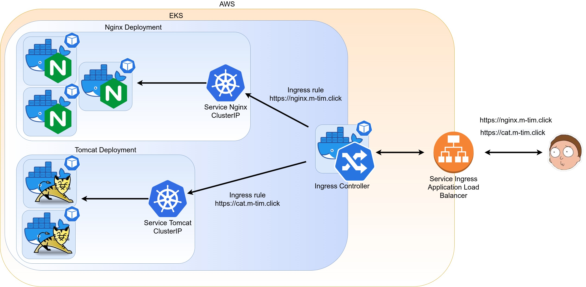

### Goals: 
- replace 2 Application Load Balancers to 1 ALB + Ingress controller
- attach ssl certificates and use real DNS name
- everything should be done by Helm charts
---
### Scheme:

---
### How to create k8s resources with Helm:
1. Follow Lesson-1 Readme to create necessary Docker images and push it to ECR
2. Create a EKS cluster. Run from lesson-3 dir
```shell
eksctl create cluster -f cluster/cluster.yaml
```
3. Create a "lesson-3" k8s namespace
```shell
kubectl create namespace lesson-3
```
4. Create nginx-ingress-controller. Run command from lesson-3 directory
```shell
helm install ingress-nginx charts/ingress-nginx/
```
5. Create nginx resources. Run command from lesson-3 directory
```shell
helm install nginx charts/nginx/ -n lesson-3
```
6. Create tomcat resources. Run command from lesson-3 directory
```shell
helm install tomcat charts/tomcat/ -n lesson-3
```

Aaaaand ssl doesn't work for this case. I tested how it works on simple ALB service
without ingress/ingress controller - it's fine. you can try to: 
```shell
helm install nginx charts/nginx-custom -n lesson-3
```
---

### Delete cluster after tests
Run from lesson-3 dir
```shell
eksctl delete cluster -f cluster/cluster.yaml
```