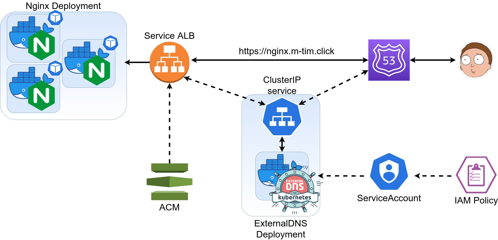

### Goals:
- [x] create 3 nginx pods with Application Load balancer
- [x] attach ssl certificate to ALB
- [x] create IAM Policy to get thin access for manage route 53 -> Create K8S serviceAccount. Attach it to "external-dns" pods only
- [x] ExternalDNS should change DNS records automatically 
- [x] everything should be done by Helm charts
---
### Scheme:


---
### How to:
1. Created IAM policy manually. Copy arn

```json
{
    "Version": "2012-10-17",
    "Statement": [
        {
            "Effect": "Allow",
            "Action": [
                "route53:ChangeResourceRecordSets"
            ],
            "Resource": [
                "arn:aws:route53:::hostedzone/*"
            ]
        },
        {
            "Effect": "Allow",
            "Action": [
                "route53:ListHostedZones",
                "route53:ListResourceRecordSets"
            ],
            "Resource": [
                "*"
            ]
        }
    ]
}
```
2. Register a DNS name and request a SSL certificate (do not forget validate it and copy arn)
3. Created ServiceAccount resource for k8s. (i.m. attach IAM Policy to K8S Service Account)
```shell
eksctl utils associate-iam-oidc-provider --region={AWS_REGION} --cluster={CLUSTER_NAME} --approve
eksctl create iamserviceaccount --name allow-external-dns-update --cluster {CLUSTER_NAME} --attach-policy-arn {POLICY_ARN} --approve


kubectl describe serviceaccounts allow-external-dns-update
Name:                allow-external-dns-update
Namespace:           default
Labels:              app.kubernetes.io/managed-by=eksctl
Annotations:         eks.amazonaws.com/role-arn: {K8S_ROLE_ARN}
Image pull secrets:  <none>
Mountable secrets:   allow-external-dns-update-token-77ttf
Tokens:              allow-external-dns-update-token-77ttf
Events:              <none>
```

3. Set several vars and install external-dns from helm chart
```shell
# charts/external-dns/values.yaml
serviceAccount:
  create: false
  annotations: {}
  name: "allow-external-dns-update"   # name of K8S serviceAccount

# run from lesson-4 dir
helm install external-dns charts/external-dns
```
4. Add annotation for LoadBalancer service and install nginx deployment from helm chart:
```shell
#charts/nginx/templates/service.yaml
service.beta.kubernetes.io/aws-load-balancer-backend-protocol: "http"
service.beta.kubernetes.io/aws-load-balancer-ssl-cert: "{ACM_SSL_ARN}"
external-dns.alpha.kubernetes.io/hostname: {{ .Values.service.dnsName }}

#charts/nginx/values.yaml
service:
  dnsName   : {YOUR_FULL_DNS_NAME}

# terminal
kubectl create namespace lesson-4
helm install nginx charts/nginx
```
### Delete cluster after tests
Run from lesson-1 dir
```shell
helm delete nginx external-dns
eksctl delete cluster -f simple-cluster.yaml
```