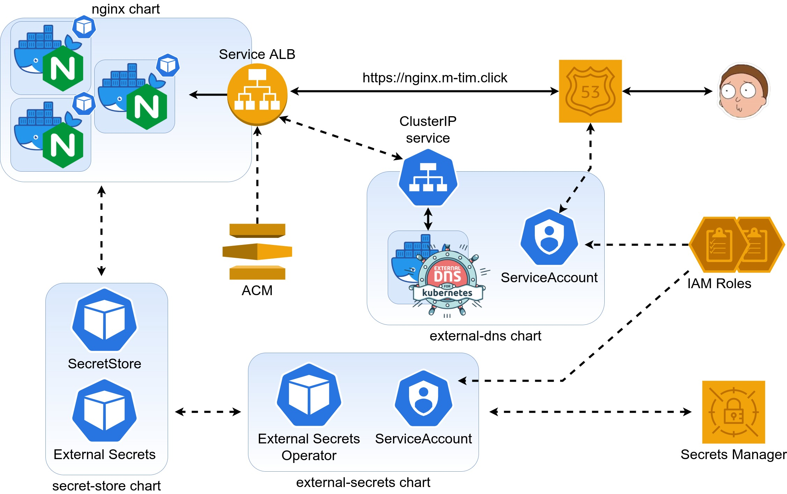

### Goals:
- [x] IAM policies and roles should be created from terminal
- [x] SSL
- [x] Each helm should create ServiceAccount
- [ ] Hostname for Route53 should be got from AWS Secrets Manager 
---
### Scheme:


---
### How to :
Run command from **lesson-5** dir
1. Create simple EKS cluster:
```shell
export AWS_PROFILE=XXXXX
eksctl create cluster -f cluster.yaml

export CLUSTER_NAME=enter-name-of-cluster
export AWS_REGION=us-east-1

# create OIDC provider
eksctl utils associate-iam-oidc-provider \
  --region $AWS_REGION \
  --cluster $CLUSTER_NAME \
  --approve

# find OIDC ID. We will need it for the next actions
aws eks describe-cluster \
  --region $AWS_REGION \
  --name $CLUSTER_NAME \
  --query "cluster.identity.oidc.issuer" \
  --output text 
```


2. Delete 'ref' from all filenames of dependencies directory. Replace all necessary 
variables for those files (AWS_ACCOUNT_ID, AWS_REGION, OIDC_ID, etc.)


3. Create IAM policy and role for work with AWS **Route53** service.
```shell
POLICY_NAME=AllowExternalDNSUpdate
ROLE_NAME=AllowExternalDNSUpdate

aws iam create-policy \
  --policy-name $POLICY_NAME \
  --policy-document file://"dependencies/allow-external-dns-update.json"

POLICY_ARN=$(aws iam list-policies --query "Policies[?PolicyName=='${POLICY_NAME}'].Arn" --output text)

aws iam create-role \
  --role-name $ROLE_NAME \
  --assume-role-policy-document file://"dependencies/eks-iam-trust-policy.json"  

aws iam attach-role-policy \
  --policy-arn $POLICY_ARN \
  --role-name $ROLE_NAME
```


4. Create IAM policy and role for work with AWS **Secrets Manager**:
```shell
POLICY_NAME=AllowGetSecrets
ROLE_NAME=AllowGetSecrets

aws iam create-policy \
  --policy-name $POLICY_NAME \
  --policy-document file://"dependencies/allow-get-secrets.json"

POLICY_ARN=$(aws iam list-policies --query "Policies[?PolicyName=='${POLICY_NAME}'].Arn" --output text)

aws iam create-role \
  --role-name $ROLE_NAME \
  --assume-role-policy-document file://"dependencies/eks-iam-trust-policy.json"  

aws iam attach-role-policy \
  --policy-arn $POLICY_ARN \
  --role-name $ROLE_NAME
```


5. Create necessary secrets:
- Name: **k8s-lessons/lesson-5**
  - Key: nginx-external-dns. Value: necessary-dns-name

6. Register a DNS name and request a SSL certificate (do not forget validate it and copy arn)


7. Set several vars and install external-dns from helm chart
```shell
# charts/external-dns/values.yaml
serviceAccount:
  create: true
  annotations: {
    eks.amazonaws.com/role-arn: {ROLE_ARN}
  }
  name: "allow-external-dns-update"   # name of K8S serviceAccount

helm install external-dns charts/external-dns
```
8. Create external-secrets and apply SecretStore+ExternalSecret
```shell
helm install external-secrets charts/external-secrets --debug
# wait about few minutes
helm install secret-store charts/secret-store --debug
```
9. Add annotation for LoadBalancer service and install nginx deployment from helm chart:
```shell
#charts/nginx/templates/service.yaml
service.beta.kubernetes.io/aws-load-balancer-backend-protocol: "http"
service.beta.kubernetes.io/aws-load-balancer-ssl-cert: "{ACM_SSL_ARN}"
external-dns.alpha.kubernetes.io/hostname: {{ .Values.service.dnsName }}

#charts/nginx/values.yaml
service:
  dnsName   : {YOUR_FULL_DNS_NAME}

# terminal
kubectl create namespace lesson-5
helm install nginx charts/nginx
```
### Delete cluster after tests
Run from lesson-1 dir
```shell
helm delete nginx external-dns
eksctl delete cluster -f simple-cluster.yaml
```
