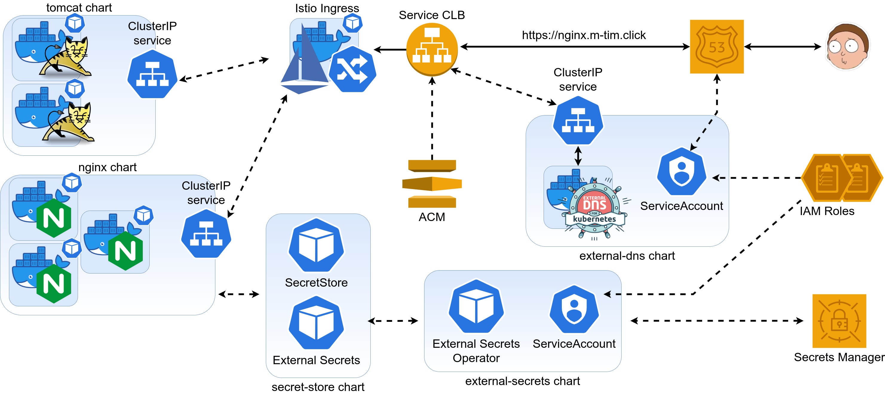

### Goals:
- [x] Replace CLB for each web to Istio Ingress

---
### Scheme:


---
### How to :
Run command from **lesson-6** dir
1. Create simple EKS cluster:
! Be careful cause this is pretty big single **t3.2xlarge** node with 32GB RAM 
```shell
export AWS_PROFILE=XXXXX
export CLUSTER_NAME=enter-name-of-cluster
export AWS_REGION=us-east-1

eksctl create cluster -f cluster.yaml

# create OIDC provider
eksctl utils associate-iam-oidc-provider \
  --region $AWS_REGION \
  --cluster $CLUSTER_NAME \
  --approve

# find OIDC ID. We will need it for the next actions
aws eks describe-cluster \
  --region $AWS_REGION \
  --name $CLUSTER_NAME \
  --query "cluster.identity.oidc.issuer" \
  --output text 
```


2. Delete 'ref' from all filenames of dependencies directory. Replace all necessary 
variables for those files (AWS_ACCOUNT_ID, AWS_REGION, OIDC_ID, etc.)


3. Create IAM policy and role for work with AWS **Route53** service.
```shell
POLICY_NAME=AllowExternalDNSUpdate
ROLE_NAME=AllowExternalDNSUpdate

aws iam create-policy \
  --policy-name $POLICY_NAME \
  --policy-document file://"dependencies/allow-external-dns-update.json"

POLICY_ARN=$(aws iam list-policies --query "Policies[?PolicyName=='${POLICY_NAME}'].Arn" --output text)

aws iam create-role \
  --role-name $ROLE_NAME \
  --assume-role-policy-document file://"dependencies/eks-iam-trust-policy.json"  

aws iam attach-role-policy \
  --policy-arn $POLICY_ARN \
  --role-name $ROLE_NAME
```


4. Create IAM policy and role for work with AWS **Secrets Manager**:
```shell
POLICY_NAME=AllowGetSecrets
ROLE_NAME=AllowGetSecrets

aws iam create-policy \
  --policy-name $POLICY_NAME \
  --policy-document file://"dependencies/allow-get-secrets.json"

POLICY_ARN=$(aws iam list-policies --query "Policies[?PolicyName=='${POLICY_NAME}'].Arn" --output text)

aws iam create-role \
  --role-name $ROLE_NAME \
  --assume-role-policy-document file://"dependencies/eks-iam-trust-policy.json"  

aws iam attach-role-policy \
  --policy-arn $POLICY_ARN \
  --role-name $ROLE_NAME
```


5. Create necessary secrets:
- Name: **k8s-lessons/lesson-6**
  - Key: **nginx-external-dns**. Value: necessary-dns-name
  - Key: **nginx-username**. Value: necessary-username
  - Key: **nginx-password**. Value: necessary-password

6. Register a DNS name and request a SSL certificate (do not forget validate it and copy arn)

7. Install istio by istioctl:
! Istio with profile=default requires more than 16GB RAM. But it isn't 100% 
```shell
# check that istioctl was installed before
istioctl version

# install istio with default profile
istioctl install --set profile=default -y

# check istictl version again. New istio components should be present
istioctl version
```

8. Add annotation for istio-ingressgateway
```shell
kubectl edit service -n istio-system istio-ingressgateway

# add this block. replace ACM_CERTIFICATE_ARN
    service.beta.kubernetes.io/aws-load-balancer-backend-protocol: tcp
    service.beta.kubernetes.io/aws-load-balancer-connection-idle-timeout: "3600"
    service.beta.kubernetes.io/aws-load-balancer-ssl-cert: ACM_CERTIFICATE_ARN
    service.beta.kubernetes.io/aws-load-balancer-ssl-ports: https
```

9. Set several vars and install external-dns from helm chart
```shell
# charts/external-dns/values.yaml
serviceAccount:
  create: true
  annotations: {
    eks.amazonaws.com/role-arn: {ROLE_ARN}
  }
  name: "allow-external-dns-update"   # name of K8S serviceAccount

helm install external-dns charts/external-dns --debug
```

10. Create external-secrets and apply SecretStore+ExternalSecret
```shell
helm install external-secrets charts/external-secrets --debug
# wait about few minutes
kubectl create namespace lesson-6
helm install cluster-secret-store charts/cluster-secret-store --debug
```

11. Install nginx and tomcat deployments from helm charts:
```shell
helm install nginx charts/nginx --debug
helm install tomcat charts/tomcat --debug
```

12. Create gateway and virtualservice resources. Should be created in the same namespace as
your target application (nginx in our case)
```shell
kubectl apply -f istio-parts/gateway.yaml

# replace hostname for virtualservice.yaml in spec.hosts.
kubectl apply -f istio-parts/virtualservice.yaml
```


### Delete cluster after tests
Run from lesson-6 dir
```shell
#delete helm resources
helm delete cluster-secret-store external-dns external-secrets nginx tomcat

#delete roles and policyes
export AWS_ACCOUNT_ID=123456789012
export POLICY_NAME=AllowExternalDNSUpdate
export ROLE_NAME=AllowExternalDNSUpdate

aws iam detach-role-policy \
  --role-name $ROLE_NAME \
  --policy-arn arn:aws:iam::$AWS_ACCOUNT_ID:policy/$POLICY_NAME
aws iam delete-role --role-name $ROLE_NAME
aws iam delete-policy --policy-arn arn:aws:iam::$AWS_ACCOUNT_ID:policy/$POLICY_NAME

export POLICY_NAME=AllowGetSecrets
export ROLE_NAME=AllowGetSecrets
aws iam detach-role-policy \
  --role-name $ROLE_NAME \
  --policy-arn arn:aws:iam::$AWS_ACCOUNT_ID:policy/$POLICY_NAME
aws iam delete-role --role-name $ROLE_NAME
aws iam delete-policy --policy-arn arn:aws:iam::$AWS_ACCOUNT_ID:policy/$POLICY_NAME

# delete istio
istioctl experimental uninstall --purge -y

#terminate EKS cluster
eksctl delete cluster -f cluster.yaml
```
