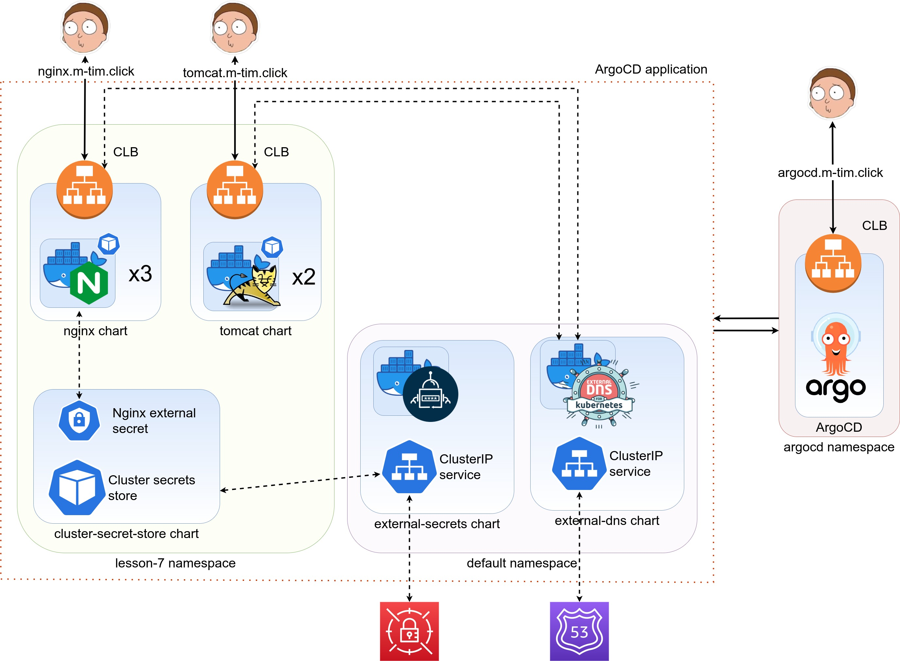

### Goals:
- [x] Deploy this scheme using ArgoCD
- [x] Check how it works with manual creation of ArgoCD Applications
- [x] Check how creation of ArgoCD Applications works with argoCLI
- [x] Integrate Prometheus for Amazon Managed Prometheus (AMP) + Amazon Managed Grafana (AMG)

---
### Scheme:


---
### How to :
Run command from **lesson-7** dir
1. Create simple EKS cluster:
   ! Be careful cause this is pretty big single **t3.2xlarge** node with 32GB RAM
```shell
export AWS_PROFILE=enter-name-of-aws-profile
export CLUSTER_NAME=enter-name-of-cluster
export AWS_REGION=us-east-1

eksctl create cluster -f cluster.yaml


# find OIDC ID. We will need it for the next actions
aws eks describe-cluster \
  --region $AWS_REGION \
  --name $CLUSTER_NAME \
  --query "cluster.identity.oidc.issuer" \
  --output text 
```

2. Delete 'ref' from all filenames of dependencies directory. Replace all necessary
   variables for those files (AWS_ACCOUNT_ID, AWS_REGION, OIDC_ID, etc.)

3. Create IAM policy and role for work with AWS **Route53** service.
```shell
POLICY_NAME=AllowExternalDNSUpdate
ROLE_NAME=AllowExternalDNSUpdate

aws iam create-policy \
  --policy-name ${POLICY_NAME} \
  --policy-document file://"dependencies/allow-external-dns-update.json"

POLICY_ARN=$(aws iam list-policies --query "Policies[?PolicyName=='${POLICY_NAME}'].Arn" --output text)

aws iam create-role \
  --role-name ${ROLE_NAME} \
  --assume-role-policy-document file://"dependencies/eks-iam-trust-policy.json"  

aws iam attach-role-policy \
  --policy-arn ${POLICY_ARN} \
  --role-name ${ROLE_NAME}
```


4. Create IAM policy and role for work with AWS **Secrets Manager**:
```shell
POLICY_NAME=AllowGetSecrets
ROLE_NAME=AllowGetSecrets

aws iam create-policy \
  --policy-name ${POLICY_NAME} \
  --policy-document file://"dependencies/allow-get-secrets.json"

POLICY_ARN=$(aws iam list-policies --query "Policies[?PolicyName=='${POLICY_NAME}'].Arn" --output text)

aws iam create-role \
  --role-name ${ROLE_NAME} \
  --assume-role-policy-document file://"dependencies/eks-iam-trust-policy.json"  

aws iam attach-role-policy \
  --policy-arn ${POLICY_ARN} \
  --role-name ${ROLE_NAME}
```

5. Create necessary secrets:
- Name: **k8s-lessons/lesson-7**
    - Key: **nginx-external-dns**. Value: necessary-dns-name
    - Key: **nginx-username**. Value: necessary-username
    - Key: **nginx-password**. Value: necessary-password

6. Register a DNS name and request a SSL certificate (do not forget validate it and copy arn)


7. Install ArgoCD
```shell
kubectl create namespace argocd
kubectl apply -n argocd -f https://raw.githubusercontent.com/argoproj/argo-cd/stable/manifests/install.yaml

# make ArgoCD available from outside
kubectl patch svc argocd-server -n argocd -p '{"spec": {"type": "LoadBalancer"}}'

# get ArgoCD password. Username us 'admin'
kubectl -n argocd get secret argocd-initial-admin-secret -o jsonpath="{.data.password}" | base64 -d; echo
````

Create route 53 record for argocd 
```shell
# you can login via ArgoCLI 
argocd login {ARGO_HOSTNAME}
  # admin/pass
argocd account update-password
```

8. Find your cluster context
```shell
kubectl config get-contexts -o name
argocd cluster add {CLUSTER_CONTEXT_ARN}
```

9.  [MANUAL FROM UI] Create an Application in ArgoCD from Git repo
see bellow for CLI
**Pre-settings**
- Create Repository: ArgoCD UI -> Settings -> Repositories ->
  Connect repo using SSH -> Enter parameters -> Save as credentials template.
- Create Project: ArgoCD UI -> Settings -> Projects -> New Project ->
  Enter parameters -> Create

**Example for external-dns**

Create external-dns application: ArgoCD UI -> New App -> Enter parameters:
- Application Name: the same as helm release name
- Project: which you created before
- Sync Policy: Automatic
- Prune resources: enabled
- Auto-create namespace: enabled
- Repository URL: which you created before
- Revision: HEAD
- Path: lesson-7/external-dns
- Cluster URL: choose your iam-oidc-provider which was created before
- Namespace: default

-> Create

9. [FROM CLI] Create an Application in ArgoCD from Git repo


**Pre-settings**
- Create Repository:
```shell
argocd repo add {GITHUB_REPO_SSH_URL} --ssh-private-key-path {PATH_TO_PRIVKEY}
```
- Create project:
change your project*.yaml file before apply. destination.server should be replaced 
```shell
kubectl apply -f argocd-structure/project/mtim-lesson7.yaml
```
- Create all applications
change your application*.yaml file before apply. destination.server should be replaced
```shell
kubectl apply -f argocd-structure/application/external-dns.yaml
kubectl apply -f argocd-structure/application/external-secrets.yaml

# wait for few minutes
kubectl apply -f argocd-structure/application/cluster-secret-store.yaml
kubectl apply -f argocd-structure/application/nginx.yaml
kubectl apply -f argocd-structure/application/tomcat.yaml
```

10. Create AMP
11. Create IAM roles
12. Create prometeus
13. Create AMG

### Delete cluster after tests
Run from lesson-7 dir
```shell
#delete helm resources
helm delete cluster-secret-store.yaml external-dns external-secrets.yaml nginx tomcat

#delete roles and policyes
export AWS_ACCOUNT_ID=123456789012
export POLICY_NAME=AllowExternalDNSUpdate
export ROLE_NAME=AllowExternalDNSUpdate

aws iam detach-role-policy \
  --role-name $ROLE_NAME \
  --policy-arn arn:aws:iam::$AWS_ACCOUNT_ID:policy/$POLICY_NAME
aws iam delete-role --role-name $ROLE_NAME
aws iam delete-policy --policy-arn arn:aws:iam::$AWS_ACCOUNT_ID:policy/$POLICY_NAME

export POLICY_NAME=AllowGetSecrets
export ROLE_NAME=AllowGetSecrets
aws iam detach-role-policy \
  --role-name $ROLE_NAME \
  --policy-arn arn:aws:iam::$AWS_ACCOUNT_ID:policy/$POLICY_NAME
aws iam delete-role --role-name $ROLE_NAME
aws iam delete-policy --policy-arn arn:aws:iam::$AWS_ACCOUNT_ID:policy/$POLICY_NAME

# delete istio
istioctl experimental uninstall --purge -y

#terminate EKS cluster
eksctl delete cluster -f cluster.yaml
```
